# 📌 PJT-Video-Inpainting

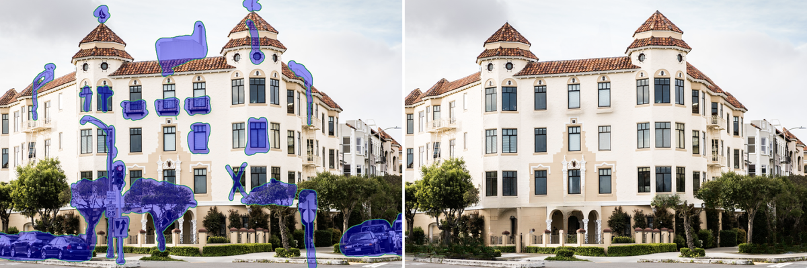

10개월간 진행되는 [이어드림스쿨 AI 교육 과정(DS트랙 3기, 2023)](https://yeardream.ninehire.site/)의 피날레라고 할 수 있는, 인턴 수준의 기업 연계 프로젝트에 참여했다. 이 프로젝트를 수행하기 위한 인페인팅 기술의 3단계는 객체 마스킹, 마스킹 추적, 인페인팅 순서이며, 기술 구현을 위해 특정한 객체를 감지해서 분할하는 Meta의 SAM(Segment Anything Models)과 앞서 특정한 객체를 끊김이 없이 추적하는 DeAOT(Decoupling features in Associating Objects with Transformers) 그리고 동영상 내에 모든 마스킹된 대상을 인페인팅 하는 E2FGVI(End-to-End Framework for Flow-Guided Video Inpaintihg)의 알고리즘과 Gradio 라이브러리를 활용한 GUI로 최종 결과물을 도출했다. 

  
## 01 Project Overview
[기업연계프로젝트] 동영상 내에 특정 로고를 인페인팅 함으로써, 광고 산업 뿐만 아니라 영상 제작 시 방송 규정을 준수해야 하는 부분 또는 제작 기간 한계에 따른 문제 등 비즈니스 최적화에 목표로 두었다.

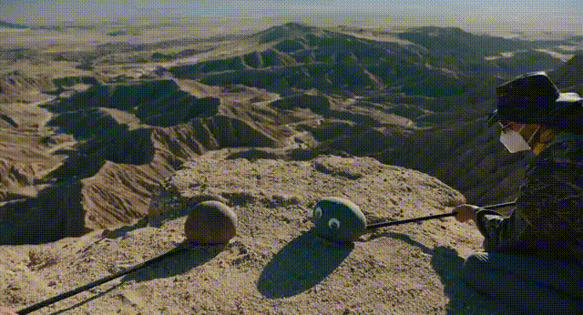
<인페인팅기술을 활용한 VFX 영화 'Everything everywhere all at once, 2022'>
  

- 📅 진행기간: 2023/11/06 ~ 2023/12/15 (5주)
- 🤝 연계기업: [(주)커넥트브릭](https://connectbrick.com/)
- 🚣‍♀️ Team Inpainterz(5명): [강도성](https://github.com/kang952175), [경소현](https://github.com/SohyeonGyeong), [변웅진](https://github.com/1ncarnati0n), [지경호](https://github.com/zkhshub) 그리고 [**손수진**](https://github.com/Soosembly)

|팀 원|역 할|
|:--:|--|
|강도성|논문 리뷰, 오픈소스 리서치, 서버 관리, 코드 및 프로그래밍, Gradio GUI, 중간발표|
|경소현|논문 리뷰, 오픈소스 리서치, Gradio GUI|
|변웅진|논문 리뷰, 오픈소스 리서치, Gradio GUI, 키노트 프레젠테이션준비, 현장발표|
|**손수진**|논문 리뷰, 오픈소스 리서치, Gradio GUI, 키노트 프레젠테이션준비|
|지경호|논문 리뷰, 오픈소스 리서치, 서버 관리, 코드 및 프로그래밍, Gradio GUi, 최종발표|

  
## 02 Tech Stack and Dataset Description
Meta에서 개발된 객체 분할 및 세그멘테이션 모델로, 제로샷 러닝을 활용하여 이미지와 비디오에서 다양한 객체를 정확하게 식별하고 분리하는 [**SAM**(Segment Anything Models)](https://github.com/facebookresearch/segment-anything)과 객체 추적 및 연관성 부여 작업을 위해 트랜스포머 아키텍처를 활용하는 모델로, 다중 객체 추적과 연관성 부여를 개선하는 [**DeAOT**(Decoupling features in Associating Objects with Transformers)](https://github.com/yoxu515/aot-benchmark) 그리고 비디오 인페인팅 작업을 위한 종합 프레임워크로, 영상에서 누락된 부분을 자연스럽게 보정하여 누락된 부분을 채우는 [**E2FGVI** (End-to-End Framework for Flow-Guided Video Inpainting)](https://github.com/MCG-NKU/E2FGVI)등을 선별하여 적용했다.

본 프로젝트에서는 인페인팅 기술 구현을 위해 [SAM], [DeAOT], [E2FGVI] 등의 모델 알고리즘을 활용하였다. 이러한 접근 방식은 특정한 데이터셋에 의존하지 않고, 각 모델의 기존 학습된 능력을 바탕으로 이미지와 비디오에서의 객체 식별, 추적, 및 인페인팅 작업을 수행한다. 따라서, 별도의 데이터셋을 구축하거나 사용하지 않고, 모델들이 제공하는 기능을 최대한 활용하여 프로젝트 목표를 달성하였다.

  
## 03 Stages of project progress
사이클 브랜드 라파 광고 장면 중에서 선수의 상의 측면에 있는 로고(특정한 객체)를 인페인팅 하는 과정

 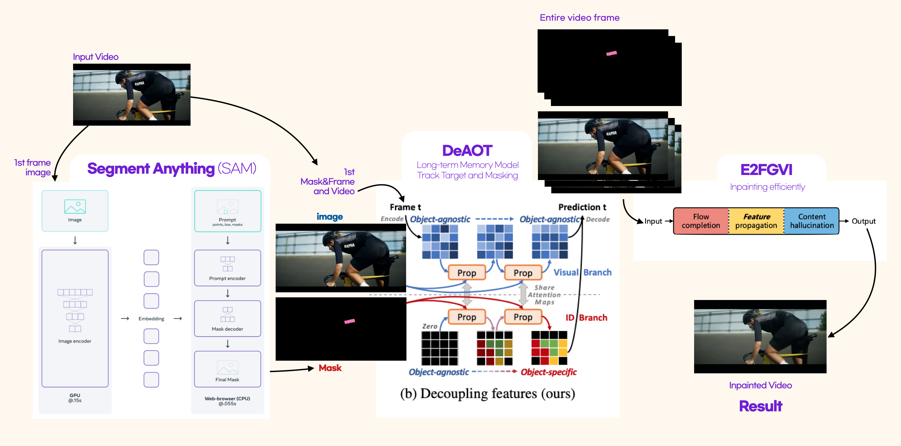 

**1. SAM** Segmentation & Masking
   동영상에서 인페인팅할 객체를 선택하고 분리하기 위해 Segmentation 기술을 사용.
   세밀한 객체 인식과 시각적 구분을 통해 영상의 특정 부분을 정교하게 분리하고, 이를 마스킹하여 인페인팅 알고리즘 작업을 위한 준비를 한다.
  
**2. DeAOT** Tracking, use Long-term Memory
   Long-term Memory를 이용해 Masking된 객체를 특정 프레임별로 추적한다. 이 과정은 동영상의 연속성을 유지하고, 객체의 움직임을 정확하게 따라가며 Masking된 이미지를 추출한다.

**3. E2FGVI** Inpainting
   Masking된 영상을 입력(Input)받아, 복원해야 할 누락된 부분을 인식한다.
   이 과정에서 알고리즘은 주변 픽셀 정보를 활용해 누락된 부분의 색생과 텍스처 등을 추정하고 채워 자연스럽게 복원한다.

**4. Gradio** 라이브러리를 활용해 사용자가 쉽게 인페인팅 작업을 수행할 수 있도록 사용자 친화적인 인터페이스(GUI)를 구성하여 제공함.

  
## 04 Project Details Course
### SAM

 Segment Anything Model 
 
	
 📑 [**Paper**](https://ai.meta.com/research/publications/segment-anything/) 

기존의 이미지 세그멘테이션 기술은 경계 감지(Edge Detection), 임계값 설정(Thresholding), 지역 기반 그룹화(Region-Based Grouping) 등의 방법을 사용했지만, 복잡한 이미지에서 정확도와 유연성에 한계가 있었다. 이러한 한계를 극복하기 위해 메타(Meta)에서 개발한 고급 이미지 세그멘테이션 모델인 SAM은 딥러닝과 인공지능 기술을 활용하여 이미지내의 다양한 객체를 정확하게 식별하고 분할할 수 있다.  

메타 AI의 'Segment Anything' 프로젝트는 다음과 같이 세 부분으로 구성된다.

- **작업(Task)**
 '프롬프트 가능한 세그멘테이션 작업(Promptable Segmentation Task)'은 다양한 형태의 입력(점, 상자, 텍스트, 마스크)을 받아, 이미지 내 특정 영역을 분할하는 마스크를 생성한다. 이 작업은 모호한 프롬프트에도 유효한 세그멘테이션 결과를 제공하도록 설계되었다.

  

- **모델(Model)** 
 'Segment Anything Model' (SAM)은 이미지 인코더와 프롬프트 인코더, 마스크 디코더로 구성되어 있으며, 다양한 입력 프롬프트에 대응하여 마스크를 효율적으로 예측한다.
	- 이미지 인코더(Image Encoder): 입력된 이미지에서 중요한 시각적 특징을 추출하여 임베딩을 생성. 이는 이미지의 복잡한 내용을 효과적으로 해석하는 데 중요하다.
 	- 프롬프트 인코더(Prompt Encoder): 사용자의 지시(예: Text, Points, Boxes)를 처리하여 관련 임베딩을 생성. 이를 통해 모델이 사용자의 의도를 파악하고 적절한 반응을 할 수 있다.
  	- 마스크 디코더(Mask Decoder): 이미지 인코더와 프롬프트 인코더에서 얻은 정보를 결합하여 세그멘테이션 마스크를 생성. 이 과정에서 셀프 어텐션(Self-Attention)과 크로스 어텐션(Cross-Attention)을 활용하여 이미지와 프롬프트 임베딩을 모두 업데이트 하는데, 이 구조는 빠르고 효율적인 성능을 제공한다. 따라서 같은 이미지 임베딩을 여러 프롬프트와 함께 재사용할 수 있어, CPU환경에서도 웹 상에서 50ms 이내에 마스크를 예측할 수 있다. 이러한 빠른 처리 속도는 모델의 효율성과 사용자 경험을 향상시키는 중요한 요소이다. 

  

- **데이터(Data)**
 'SA-1B 데이터셋'은 메타의 'Segment Anything' 프로젝트의 일부로, 11백만 이미지와 10억 개의 세그멘테이션 마스크를 포함한다. 이 데이터셋은 다양한 이미지와 작업에 대해 모델의 일반화 능력을 향상시키도록 설계되었으며, 수집 과정은 수동, 반자동, 완전 자동의 세 단계로 이루어진다. 이 과정을 통해 대규모 마스크 데이터를 효율적으로 수집하고, SAM 모델의 성능을 극대화한다.

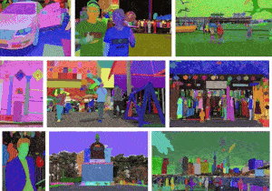
  

 

### DeAOT

 Decoupling Features in Associating Objects with Transformers 
 

📑 [**Paper**](https://arxiv.org/abs/2210.09782)

DeAOT는 비디오 객체 세분화(VOS, Video Object Segmentation)를 위한 모델로, 비전 트랜스포머와 AOT(Associating Objects with Transformers)를 사용하여 객체들을 세밀하게 구분한다. 이 모델은 계층적 전파(hierarchical propagation) 방식을 사용하여 이전 프레임에서 현재 프레임으로 정보를 전달하는데, 깊은 층에서 시각적 정보 손실이 발생하는 문제를 해결하기 위해 게이트 전파 모듈(Gated Propagation Module, GPM)을 사용한다. DeAOT는 객체 정보와 무관한 정보를 분리하여 처리함으로써 기존 모델보다 효율적인 정보 전달을 가능하게 하고, 정확도와 효율성 면에서 우수한 성능을 보여준다.

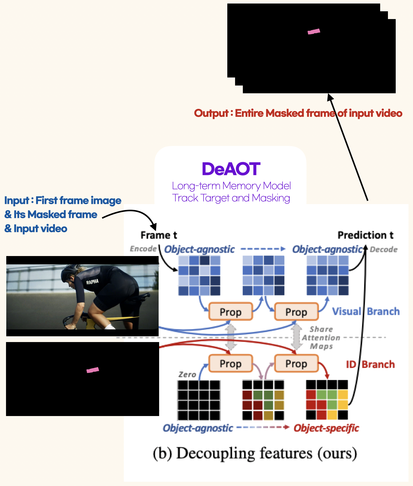
  

즉, DeAOT는 비디오 객체 세분화를 위한 혁신적인 모델로, 두 개의 독립된 branch를 사용한다. 첫 번째 Visual branch는 각 패치의 시각적 임베딩에 대한 주의력 지도(attention map)를 계산하여 객체 일치를 담당, 두 번째 ID Branch는 프레임 간 객체 정보를 효과적으로 전파한다. 이렇게 병렬적으로 처리되는 정보 흐름은 보다 정확하고 효율적인 객체 추적과 세분화를 가능하게 만든다.

  

 

### E2FGVI

 End-to-End Framework for Flow-Guided Video Inpainting 
 
	
📑 [**Paper**](https://arxiv.org/abs/2204.02663)

E2FGVI는 비디오 인페인팅을 위한 혁신적인 모델로, 기존의 흐름 기반 방법들이 가진 한계를 극복하기 위해 개발되었다. 이 모델은 마스킹된 비디오 영역을 더욱 효율적이고 정확하게 복원하는 것을 목표로 한다. 

1. **Flow-based methods(기존방법)**
 이런 일반적인 흐름기반 방법(flow-based method)는 인페인팅을 **pixel propagation** 문제로 생각하여 시간적 일관성을 자연스럽게 보존

	1. **optical flow 추정**: 비디오의 각 프레임에서 이동하는 객체들의 궤적을 추적. 이 단계는 비디오 내의 객체 움직임을 이해하는 데 필수적이다.
	2. **pixel propagation**: 추정된 optical flow를 기반으로, 손상된 비디오 영역에 픽셀을 전파. 이 과정은 손상된 부분을 복원하는 데 중요한 역할을 한다.
	3. **content hallucination**: 마지막 단계에서는 픽셀 전파로 복원되지 않은 나머지 영역을 인페인팅 네트워크로 처리. 이 단계는 누락된 부분을 자연스럽게 채워 전체적인 영상의 일관성을 유지한다.  
	
이 세 단계는 기존 방법에서 중요한 역할을 하지만, 각각 별도로 수행되어야 하며, 하나의 단계에서 발생한 오류가 다음 단계에 영향을 미칠 수 있는 단점이 있다.
	
- **이전 단계에서 발생한 오류가** 누적 후속 단계에서 증폭, **최종 성능에 큰 영향을 미침**
- **복잡한 연산**을 해야하지만, GPU acceleration 처리불가, **많은 시간이 소요**   

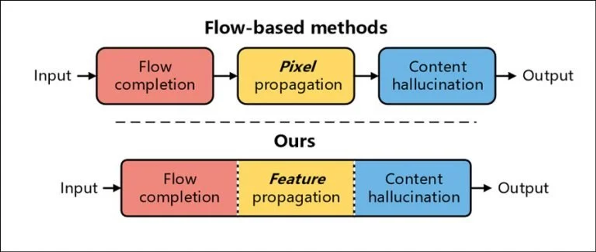
  

2. **E2FGVI(개선모델)** Fig.Ours
 이전 모델을 보완해서 기존 방식과는 다르게 **End-to-End**로 최적화 할 수 있어, 보다 효과적인 인페인팅 프로세스을 구현
	
	1. **Flow-Completion** 모듈: 마스킹된 비디오를 원-스텝으로 처리하여 복잡한 단계를 간소화한다.
	2. **Feature Propagation** 모듈: pixel-level 대신 feature space에서 flow-guided propagation을 수행하며, 이를 통해 더 정확한 flow 추정이 가능하다.
  	3. **Content Hallucination** 모듈: temporal focal transformer를 사용하여 시간적 차원에서 장거리 종속성을 모델링하고, 이를 통해 시간적으로 일관된 인페인팅 결과를 도출한다.  

- 70개의 프레임 기준으로 이 크기의 비디오 하나를 완성하는 데에 약 4분 소요. E2FGVI는 프레임당 0.12초로 약 8.4초 소요.
  

  

 

### GUI

 Gradio 

	
**gradio** 라이브러리를 활용하여 SAM, DeAOT, E2FGVI **3가지의 각 모델을 통합**하여 GUI로 구성
 (왼쪽 파라미터 조절 / 오른쪽 전체 구성화면)

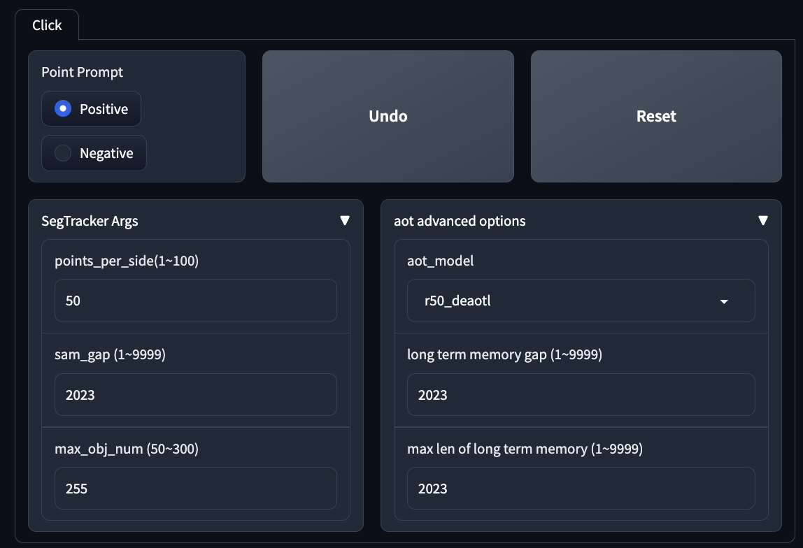 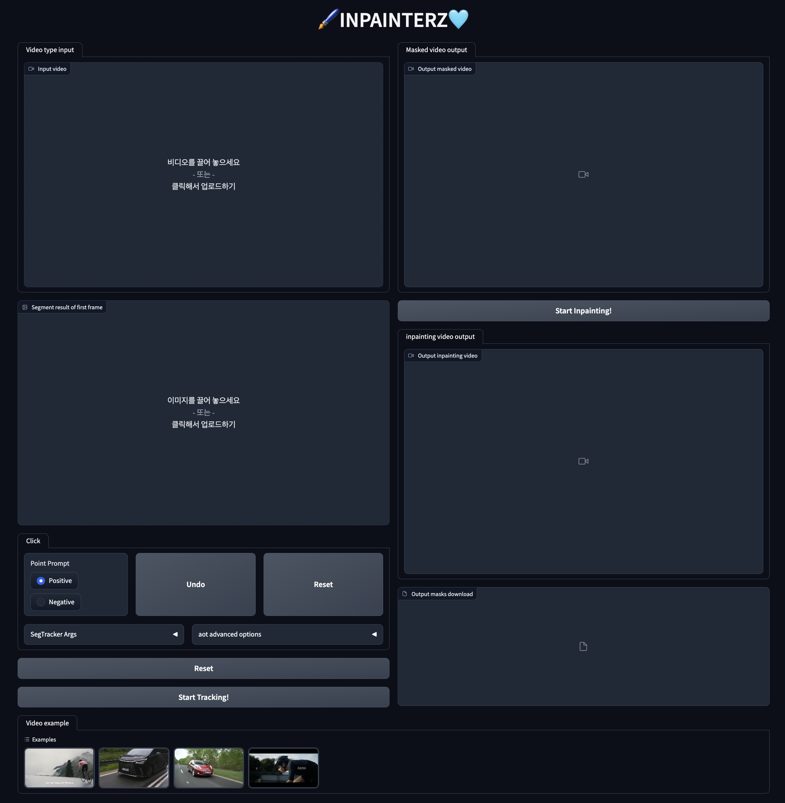
  

### Step 1. SAM 
비디오를 로드하고 영상의 첫 프레임에서 인페인팅을 하고자하는 로고를 포인트 프롬프트로 선택하여 마스킹을 한다.

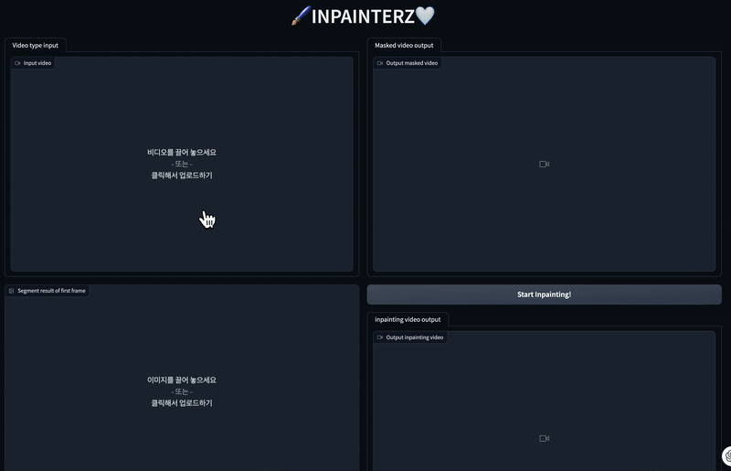
 

### Step 2. DeAOT

첫 프레임에서 마스킹된 로고를 나머지 프레임에서 자동 추적하여 마스킹하기위해 Tracking을 실행한다.

 

### Step 3. E2FGVI

영상 내 모든 프레임에서 마스킹된 로고를 인페인팅하여 결과물을 다운로드한다. 

 

  
## 05 Project Results

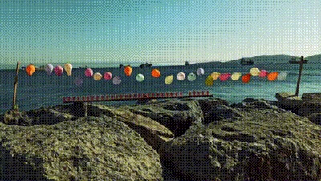

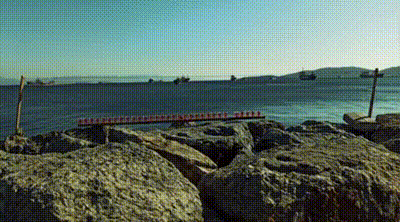

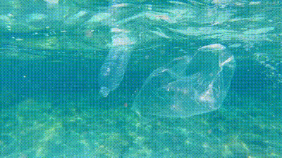
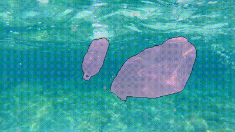
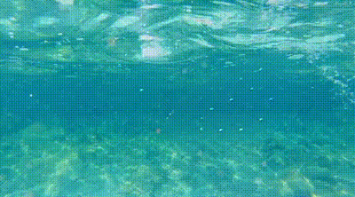

 

  
## 06 Project Retrospective
-
-
